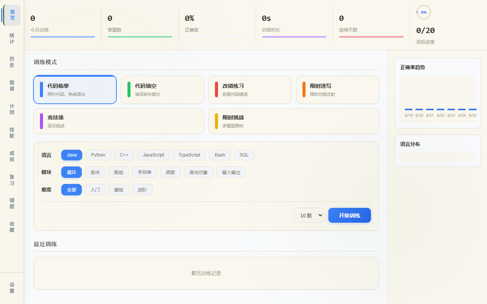

# CodeDrill

[](https://github.com/anyuer678/codedrill/actions/workflows/test.yml)

> **状态**：`portfolio` · 离线编程训练系统 · **多端完成度不一**（以本机/Windows 构建为主）  
> 已知问题与范围以 README 后文与 Issues 为准；训练核心（临摹/填空/改错 + SRS）可本地运行。  
> 在线 Pages 预览功能受限（见下方说明）。


[](https://anyuer678.github.io/codedrill/)
> ⚠️ **在线预览功能受限**：部分交互（如离线训练数据持久化、TTS 语音合成、Android/iOS 原生功能）在 GitHub Pages 静态环境下不可用。建议下载安装包以获得完整体验。

**离线编程训练系统** — 最终版

支持 Web、Windows、Android 三端运行。通过代码临摹、填空、改错等训练模式，帮助开发者形成编程肌肉记忆。

<p align="center"></p>


## 功能特性

### 训练模式
- **代码临摹** — 照抄代码，熟悉语法结构和代码风格
- **代码填空** — 填写缺失的代码部分，强化记忆
- **改错练习** — 找出并修复代码错误，提升调试能力

### 支持语言
Java、Python、C++、JavaScript、TypeScript、Linux Shell、SQL

### 训练模块
循环、条件判断、数组操作、字符串处理、函数调用

### 界面与主题
- 22 种浅色主题（纯色/渐变/纸纹/水墨风格）
- 响应式设计，适配桌面和移动端

### 学习体系
- **训练历史** — 本机 localStorage：列表 / 清空 / 导出 JSON（上限 500 条，无云同步）
- **成就系统** — 完成特定目标解锁成就
- **技能树** — 可视化技能掌握进度
- **遗忘曲线复习** — 基于艾宾浩斯曲线智能复习

## 快速开始

### 环境要求
- Node.js >= 18.0.0
- npm 或 yarn

### 安装与运行
```bash
# 克隆项目
git clone <repository-url>
cd codedrill

# 安装依赖
npm install

# 启动开发服务器
npm run dev
# 或使用 PowerShell 脚本
.\start.ps1
```

访问 http://localhost:3000 查看应用

## 构建

### 交互式构建
```bash
.\build.ps1    # 交互式选择构建目标
```

### 命令行构建
```bash
npm run build:www    # 构建 Web 版本 → dist/web/
npm run build:apk    # 构建 Android APK
npm run build:exe    # 构建 Windows 便携版 EXE
npm run build:all    # 构建全部平台
```

### 构建产物
- **Web**: `dist/web/` — 可直接部署到任意静态服务器
- **Windows**: `dist/electron-build/CodeDrill-便携版.exe` — 无需安装，双击运行
- **Android**: `android/app/build/outputs/apk/` — 需签名后安装

## 技术栈

| 层级 | 技术 |
|------|------|
| 前端框架 | Vue 3 |
| 状态管理 | Pinia |
| 路由 | Vue Router |
| 构建工具 | Vite |
| 桌面端 | Electron + electron-builder |
| 移动端 | Capacitor (Android) |
| 测试 | Vitest |

## 平台支持

| 平台 | 格式 | 状态 |
|------|------|------|
| Web | HTML/CSS/JS | ✅ 完整支持 |
| Windows | EXE 便携版 | ✅ 完整支持 |
| Android | APK | ✅ 完整支持 |

## 项目结构

```
codedrill/
├── src/                    # Vue 3 前端源码
│   ├── views/              # 页面组件（首页、训练、统计等）
│   ├── stores/             # Pinia 状态管理（题目、进度、设置）
│   ├── components/         # 通用组件（卡片、按钮、弹窗等）
│   ├── design-system/      # 设计系统（主题、颜色、字体）
│   ├── router/             # 路由配置
│   ├── data/               # 静态数据
│   └── lib/                # 工具函数
├── core/                   # 题库数据
│   ├── questions/          # 635 道内置题目（35 个题库 JSON）
│   └── bosses/             # Boss 关卡数据
├── public/                 # 静态资源（主题图、图标）
├── electron/               # Electron 主进程
│   ├── main.js             # 主进程入口
│   └── preload.js          # 预加载脚本
├── android/                # Android 工程（Capacitor）
├── dist/                   # 构建输出
│   ├── web/                # Web 构建产物
│   └── electron-build/     # Windows 构建产物
├── scripts/                # 辅助脚本
├── docs/                   # 项目文档
├── index.html              # 入口 HTML
├── vite.config.js          # Vite 配置
├── electron-builder.config.mjs  # Electron 打包配置
├── package.json            # 项目配置
├── start.ps1               # 开发启动脚本
└── build.ps1               # 构建脚本
```

## 开发状态

> **学习记录（历史）**：已落地**最小稳定存储**（localStorage + 列表/清空/导出 JSON），并附单测。  
> **完整 UI/架构「彻底重构」已冻结**——不在当前范围；若未来重做会另开 Issue，不阻塞现有功能。

### 学习记录能力与限制（诚实声明）

| 能力 | 状态 | 说明 |
|------|------|------|
| 列表 / 筛选 / 分页 | ✅ | `/history` 页；按模式、语言过滤 |
| 导出 JSON | ✅ | History 页或设置页；含 schemaVersion 与 limits 说明 |
| 导出 CSV / 全量备份 JSON | ✅ | 设置页「数据管理」 |
| 导入备份 JSON | ✅ | 设置页 |
| 清空历史 / 清除全部数据 | ✅ | History 页「清空历史」；设置页「清除所有数据」 |
| 持久化后端 | localStorage | `codedrill_history` / `codedrill_stats`，上限 **500** 条 |
| 云同步 / 账号 | ❌ 未实现 | 换浏览器、清站点数据即丢失；请自行导出备份 |
| IndexedDB / SQLite | ❌ 未实现 | 架构冻结，不承诺 |
| Electron/Android 原生文件落盘 | ❌ 未实现 | 当前与 Web 同用 WebView localStorage |

## 多端完成度矩阵（诚实声明）

| 平台 | 状态 | 训练核心 | 学习记录 | 说明 |
|------|------|----------|----------|------|
| Web / 本机浏览器 | 主路径 | ✅ | ✅ localStorage | Vite 构建；GitHub Pages 可预览，历史随浏览器存储 |
| Windows（Electron） | 可构建 | ✅ | ✅ 同 Web localStorage | `electron/` + `electron-builder`；便携版；图标见 Issue #3 |
| Android（Capacitor） | 骨架/部分 | ⚠️ 以本机验证为准 | ⚠️ WebView localStorage | 有 `android/` 与 capacitor 配置；**不承诺**商店级 APK |
| iOS | 未承诺 | ❌ | ❌ | 本 README 不声称可用 |
| 云同步 / 多设备 | 未实现 | — | ❌ | 无后端账号体系 |

> 矩阵原则：只写本机/CI 可复现的能力；避免「✅ 完整支持」式过度声称。

## 已知问题（跟踪于 Issues）

- 主题图构建解析 → Issue #2（已关闭）
- Electron 应用图标 → Issue #3（已关闭）
- SRS/评分核心测试 → Issue #4（已关闭）
- 历史「彻底重构」→ **冻结**；现有最小稳定存储见上文（范围与诚实性由 Issue #1 跟踪）


## 免责声明

本项目仅供学习交流与演示用途，不构成任何形式的商业服务或技术承诺。软件按「现状」提供，不作任何明示或暗示的保证。如您在使用过程中发现缺陷或问题，欢迎通过 [GitHub Issues](https://github.com/anyuer678/codedrill/issues) 反馈，但作者不因使用本软件所直接或间接产生的任何损失承担责任。

## 开源协议

本项目基于 [GNU General Public License v3.0](LICENSE) 开源。

### 协议要点
- ✅ 自由使用、修改、分发
- ⚠️ 衍生作品必须以相同许可证 (GPL v3) 开源
- ❌ 禁止闭源商业化
